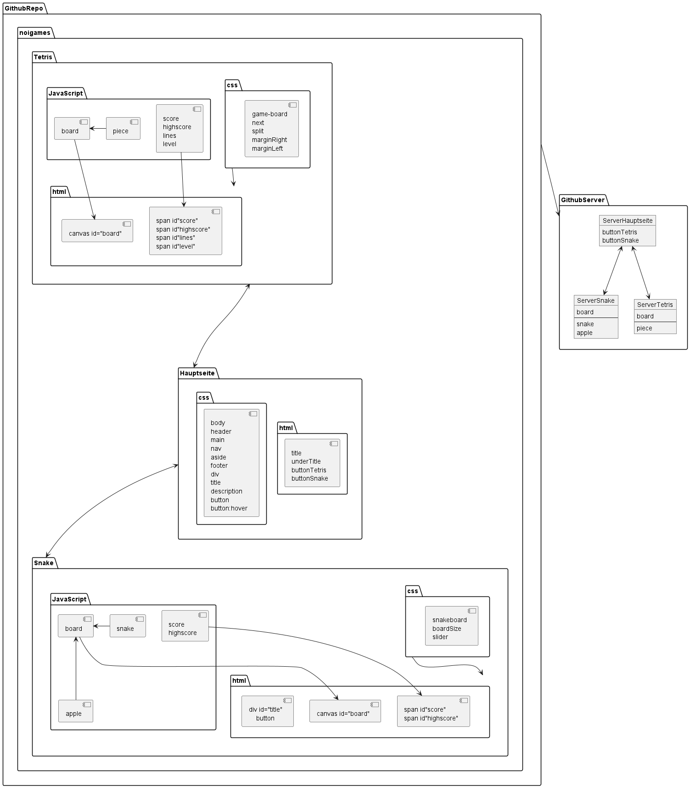

# Tetris

**Über arc42**

arc42, das Template zur Dokumentation von Software- und
Systemarchitekturen.

Template Version 8.1 DE. (basiert auf AsciiDoc Version), Mai 2022

Created, maintained and © by Dr. Peter Hruschka, Dr. Gernot Starke and
contributors. Siehe <https://arc42.org>.

::: note
Diese Version des Templates enthält Hilfen und Erläuterungen. Sie dient
der Einarbeitung in arc42 sowie dem Verständnis der Konzepte. Für die
Dokumentation eigener System verwenden Sie besser die *plain* Version.
:::

# Einführung und Ziele

Beschreibt die wesentlichen Anforderungen und treibenden Kräfte, die bei
der Umsetzung der Softwarearchitektur und Entwicklung des Systems
berücksichtigt werden müssen.

Dazu gehören:

- zugrunde liegende Geschäftsziele,

- wesentliche Aufgabenstellungen,

- wesentliche funktionale Anforderungen,

- Qualitätsziele für die Architektur und

- relevante Stakeholder und deren Erwartungshaltung.

## Aufgabenstellung

**Inhalt**

Mit Tetris sollte ich das Programmieren mit java script, html und css besser kennenlernen.  
Als erstes haben wir die Aufgaben definiert die ich beim Programmieren lösen sollte.
[Hier](https://confluence.baloisenet.com/atlassian/pages/viewpage.action?spaceKey=NLMFADMIN&title=Lernplan+-+Flavio) kann man die Aufgabenstellung lesen.

**Motivation**

Da ich später in meinem Leben Spielprogrammierer werden möchte, ist dieses kleine Projekt eine gute Möglichkeit,  
mich darauf vorzubereiten. Es hilft mir zusätzlich die Programmiersprachen Java script, html und css besser zu verstehen.  

**Form**

Das ganze habe ich mit einer [Anleitung](https://michael-karen.medium.com/learning-modern-javascript-with-tetris-92d532bcd057) geschrieben um die Grundfunktionen und die herangehensweise der einzelnen Probleme besser zu verstehen.  

## Qualitätsziele

**Inhalt**

1. Vollständig funktionsfähiges Spiel programmieren
2. Übersichtliches Design
3. Einfache Steuerung

**Motivation**

Diese 3 Ziele zeigen meiner Meinung nach gut auf, wie seriös ich das Spiel programmiert habe.
## Stakeholder

**Inhalt**

Expliziter Überblick über die Stakeholder des Systems -- über alle
Personen, Rollen oder Organisationen --, die

- die Architektur kennen sollten oder

- von der Architektur überzeugt werden müssen,

- mit der Architektur oder dem Code arbeiten (z.B. Schnittstellen
  nutzen),

- die Dokumentation der Architektur für ihre eigene Arbeit benötigen,

- Entscheidungen über das System und dessen Entwicklung treffen.

**Form**

| Rolle | Kontakt           | Erwartungshaltung   |
|-------|-------------------|---------------------|
| PA    | Lindenmann Markus | etwas gelernt haben |
| PA    | Burkhart Arno     | etwas gelernt haben |
| MA    | Navarra Sascha    | tolles Spiel        |

# Randbedingungen

**Inhalt**

Keine Randbedingungen

# Kontextabgrenzung

**Inhalt**

Das einzige Nachbarsystem, dass ich benutze ist Github.  
Github ist eine einfache und schnelle Art schnell die Daten sicher im Internet aufzubewahren und  
sogar daraus eine Webseite zu erstellen wo man von überall zugriff hat.  

**Motivation**

Verstehen wie Github funktioniert.  

**Form**

1. pushen
2. commits
3. pull requests
4. branches
5. merge
6. main

## Fachlicher Kontext

**Inhalt**

Intellij zum Programmieren, Github zum Bereitstellen für PA's und um von externen Geräten zuzugreifen.  
Confluence zum Nachschauen der Aufträge und die [Anleitung](https://michael-karen.medium.com/learning-modern-javascript-with-tetris-92d532bcd057) zum Verstehen.

**Motivation**

Für alle verständlich machen was man macht, damit man ein möglichst grossen Raum für Verständlichkeit hat,  
um möglichst viele Anspruchsgruppen zu haben  

## Technischer Kontext

**Inhalt**

JavaScript wird benutzt, um die funktionen meines Spiels zu programmieren.  
Html wird dann benutzt um, das Ganze in einem Browser anzuzeigen und css wird am Schluss benutzt, um das Ganze zu verschönern.

**Motivation**

Da wir am Anfang bestimmt haben welche Programmiersprachen ich benutze.  
Das Ganze wird sich nicht viel die Infrastruktur beeinflussen.

**Form**

Intellij --> Github --> Webseite --> PA

# Lösungsstrategie

**Inhalt**

Da wir zum programmieren immer Intellij benutzen, habe ich es auch benutzt um Tetris zu programmieren.  
Da ich schon in der Schule ein bisschen mit css und html gearbeitet habe, ist es mir leichter gefallen,  
Tetris zu programmieren, da ich nicht alles von neu auf lernen musste.  
JavaScript habe ich dann mit dieser [Anleitung](https://michael-karen.medium.com/learning-modern-javascript-with-tetris-92d532bcd057) gelernt.

**Motivation**

Mit dieser Lösungsstrategie konnte ich auch Änderungen vornehmen die nicht in der Anleitung geschrieben sind.  

# Bausteinsicht

**Inhalt**

Tetris ist in grob 3 Teile aufgeteilt. JavaScript, html, css.  
In der JavaScript Datei sind alle Funktionen von Tetris drin.  
In html wird einfach das was am Schluss angezeigt wird hineingeschrieben.  
In css steht das Design von der Website drin, wie es aussehen soll (Farbe, Form, Position usw.).

**Motivation**

Z.B. wenn man in JavaScript schaut, hat es Methoden, die die Fromen haben, die die Form fallen lassen,  
Methoden die das ganze wiederholen, die die Form und das Board reseten wenn game over ist usw.  
Wenn man am Schluss alle diese Methode zusammen nimmt und in die richtige Reihenfolge bringt,  
funktioniert das Tetris Spiel automatisch.

**Form**  

**Ebene 1**
Tetris

**Ebene 2**
Board

**Ebene 3** 
Pieces

## Whitebox Gesamtsystem

| Ebene 1    | Ebene 2 | Ebene 3      |
|------------|---------|--------------|
| Hauptseite | button  | button name  |
| Tetris     | Board   | piece        |
| Snake      | Board   | snake, apple |

Begründung

:   Das ganze habe ich so aufgeteilt, weil mir diese Aufstellung am besten gefallen hat und man diese auch sehr gut verstehen kann,  
    auch wenn man kein Informatiker ist.

Enthaltene Bausteine

:   Die Hauptseite mit der Auswahl der Spiele, die man spielen kann und daraufhin eben die Spiele.  
    Im Spiel selber hat man dann eine Aufteilung zwischen den Programmiersprachen JavaScript, html und css.  
    Diese drei Sprachen sind relevant um das Spiel überhaupt nicht spielen könnt. Css bräuchte es nicht wirklich,  
    da es nur das Design beeinflusst und nicht die Funktionen.

Wichtige Schnittstellen

:   Die wichtigsten sind JavaScript und html, da man ohne diese kein funktionierendes Programm schreiben kann.

## Ebene 1

| **Name**   | **Verantwortung**       |
|------------|-------------------------|
| Hauptseite | das Anzeigen der Spiele |
| Tetris     | das Spiel Tetris        |
| Snake      | das Spiel Snake         |

### Hauptseite

- Zweck/Verantwortung
  - Diese Seite ist dazu da, um dem User zu ermöglichen, ganz einfach das Spiel auszuwählen, was er spielen möchte.

### Tetris

- Zweck/Verantwortung
  - Auf dieser Seite kann man das Spiel Tetris spielen.

### Snake

- Zweck/Verantwortung
  - Auf dieser Seite kann man das Spiel Snake spielen.

## Ebene 2
### Board  

- in diesem Board werden dann alle Funktionen angezeigt.

### Buttons

- die buttons sind dafür da, das Spiel zu starten, den highscore zu reseten und um zurück auf die Hauptseite zu kommen,  
  je nachdem welchen button man drückt.  

## Ebene 3
### Whitebox JavaScript

- Tetris
  - das Board zeigt die pieces an, die langsam runter fallen.
- Snake
  - das Board zeigt hier die snake an und den Apfel

# Laufzeitsicht

**Inhalt**  
Die wichtigsten Abläufe sind die, die in den JavaScript Dateien ablaufen, da diese alle Funktionen der Spiele innehaben.  
Wenn ich an diesen Dateien arbeite, erstelle ich einen neuen Branch,  
sodass sich, wenn ich etwas falsch mache, sich die Fehler nicht in das Hauptprogramm schleichen.  
Das ganze Administrative läuft über Github.

**Motivation**

Sie sollten verstehen, wie (Instanzen von) Bausteine(n) Ihres Systems
ihre jeweiligen Aufgaben erfüllen und zur Laufzeit miteinander
kommunizieren.

Nutzen Sie diese Szenarien in der Dokumentation hauptsächlich für eine
verständlichere Kommunikation mit denjenigen Stakeholdern, die die
statischen Modelle (z.B. Bausteinsicht, Verteilungssicht) weniger
verständlich finden.

**Form**
## Fehlerszenario

Bei Fehlern/Bugs im Programm, kann ich ganz einfach bei mir lokal die Fehler finden und lösen.
Danach kann ic, wenn sie gelöst sind, wieder au fGithub pushen und erst dann aktualisiert sich der Server.  
Das heisst, ich kann Änderungen am Programm vornehmen ohne dass es in echt Zeit auswirkungen auf die Spielerfahrungen hat.

## Verbesserungsszenario

Wenn ich etwas zum verbessern finde, kann ich genau das gleiche machen wie bei dem Fehlerszenario.  

# Verteilungssicht
**Inhalt**
Ich habe keine spezifische Umgebung, die ich benutze.  
Das Ganze mache ich über Github.  
Das Spiel selber wird dann im Browser übers Internet gespielt.  
Da das Ganze über Github läuft, kann ich nicht einstellen, ob es nur über einen Server oder mehrere Server läuft.  
Hierfür habe ich zu wenig Anpassungsmöglichkeiten.  

**Form**

## Infrastruktur Ebene 1

In der 1. Ebene wird alles in Seiten aufgebaut.  
Bis jetzt habe ich 3 Seiten: Hauptseite, Tetris und Snake.  
Wenn ich Lust habe, könnte ich noch mehr Spiele hinzufügen.

## Infrastruktur Ebene 2

In der 2. Ebene werden die einzelnen Seiten in Programmiersprache unterteilt.  
Die Spiele jeweils haben 3 Sprachen: html, JavaScript und css.  
Die einzige ausnahem ist die Hauptseite, da die nur 2 Sprachen hat: html und css, weil diese Seite keine besonderen Funktionen hat,  
ausser das Anzeige der verschieden Spiele.  

# Querschnittliche Konzepte
**Inhalt**

Das ganze ist ganz simpel aufgebaut.  
Man hat eine Hauptseite auf der man alle Spiele sieht, die ich implementiert hat.

**Motivation**

Der übersichtliche Aufbau

# Architekturentscheidungen

**Inhalt**

Das Wichtigste, was zur Architektur beitragt ist Github.

**Motivation**

Da ich mit Github, mein Project schnell und einfach im Internet speichern kann.  
Zusätzlich kann ich meine Spiele direkt auf dem Server laufen lassen und so ohne grosse Konfiguration von überall drauf zugreifen.

# Qualitätsanforderungen

**Inhalt**

Das Design immer gleich halten um so Verwirrung zu vermeiden.  

## Qualitätsszenarien

**Inhalt**

Ein Szenario könnte sein, dass wenn ich bei einem Spiel ein Fehler einbaue,  
kann man so das Spiel nicht mehr richtig spielen und das wiederum wirkt sich auf die Motivation der Spieler aus.

**Motivation**

Bevor man also ein Update des Spiels macht, sollte man zuerst überprüfen,  
ob das Spiel einwandfrei funktioniert.  

# Risiken und technische Schulden

**Form**

- Funktionalität
- Übersichtlichkeit
- Design
